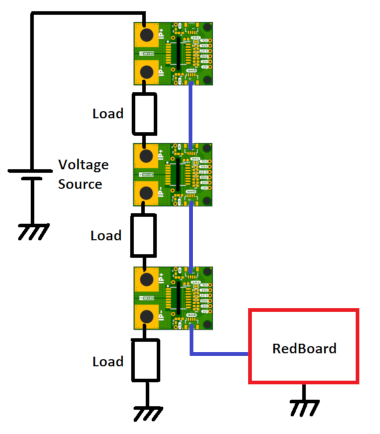

# SparkX Power Meter - ACS37800 (Qwiic)

# Hook-Up Guide - DRAFT

[*SparkX Power Meter - ACS37800 (Qwiic) (SPX-17873)*](https://www.sparkfun.com/products/17873)

Need a power sensor that can sense voltage up to 60VDC and current up to 30A? This is the product for you!

## Introduction

The Allegro MicroSystems ACS37800 power monitoring IC greatly simplifies the addition of power monitoring to many powered systems and is ideal for heavy current applications like:
- Monitoring the power drawn by a 3D-printer
- Monitoring the power drawn from a UAV battery
- Battery charging / conditioning
- Solar / photovoltaic panel power monitoring

Allegro’s Hall-effect-based, galvanically isolated current sensing technology achieves reinforced isolation ratings in a small PCB footprint. These features enable isolated current sensing without expensive Rogowski coils, oversized current transformers, isolated operational amplifiers, or the power loss of shunt resistors. The 0.85 mΩ primary conductor resistance minimises power loss and voltage drop.

The ACS37800 power monitoring IC offers key power measurement parameters that can easily be accessed through its digital interface. Dedicated and configurable I/O pins for voltage/current zero crossing, undervoltage and overvoltage reporting, and fast overcurrent fault detection are available. User configuration of the IC - including its I2C address - is available through on-chip EEPROM.

Our [Arduino library](https://github.com/sparkfun/SparkFun_ACS37800_Power_Monitor_Arduino_Library) makes it simple to add the ACS37800 into your project. We’ve also written a configuration example which you can use to examine and change all of the ACS37800’s settings through the IDE Serial Monitor or a terminal emulator.

**_Important Note:_ This product is not suitable for low current applications due to the +/-0.1A RMS Noise on the ACS37800’s current channel. Sensing less than an Amp? This is not the product for you…**

**_Safety Information:_ Although the ACS37800 power monitoring IC is capable of monitoring AC power at high line voltages, the SparkX Power Meter is designed for Safety Extra Low Voltage (SELV) applications of up to 60VDC only. Its use in AC power systems is not recommended or condoned.**

_The [SparkFun Qwiic Connect System](https://www.sparkfun.com/qwiic) is an ecosystem of I2C sensors, actuators, shields and cables that make prototyping faster and less prone to error. All Qwiic-enabled boards use a common 1mm pitch, 4-pin JST connector. This reduces the amount of required PCB space, and polarized connections mean you can’t hook it up wrong._

**_Experimental Product:_ [SparkX](https://www.sparkfun.com/sparkx) products are rapidly produced to bring you the most cutting edge technology as it becomes available. These products are tested but come with no guarantees. Live technical support is not available for SparkX products. Head on over to our [forum](https://forum.sparkfun.com/viewforum.php?f=123) for support or to ask a question.**

## High-Side Power Measurement

The Qwiic Power Meter works best in single high-side measurement applications where the ACS37800 is able to measure voltage, current and power simultaneously:
- Connect the **IP+** terminal to your voltage source
- Connect the **IP-** terminal to the load

In this configuration, the ACS37800 is able to measure load currents up to +/- 30 Amps. The **IP+** and **IP-** connections are electrically isolated from the rest of the circuit so, to measure voltage (and power), there needs to be a connection from the GND of the Qwiic Power Meter and RedBoard to the GND of the voltage source and load too. That connection is a low current path, only a thin wire is required, but it must be there otherwise the Qwiic Power Meter will not be able to measure voltage (and power).

Note: the RedBoard still needs to be powered in the usual way. The Qwiic Power Meter does not provide power _to_ the RedBoard.

In this example, all three Qwiic Power Meters will measure the same voltage but each will measure an individual load current and power:

The ACS37800 can be configured to use any valid I2 address. The address is stored in EEPROM. Please see Example2 in the Arduino library for more details. With individual addresses, multiple Qwiic Power Meters can be daisy-chained without needing a Qwiic Mux.

In this example, all three Qwiic Power Meters will measure the same current, but different totem pole voltages (and powers):

**_Important Note:_ Be careful that the Qwiic Power Meter GND connection does not accidentally become a current path which shorts out part of the power circuit. Think very carefully before connecting a jumper wire from GND to an intermediate voltage in a multi-cell, multi-photovoltaic panel or multi-load system. Do not do this:**

## Low-Side Current Measurement

The Qwiic Power Meter can be connected into the low-side of a power circuit too. However, when connected like this, it is only able to measure current, not voltage or power. (Advanced users can: cut the **IP+** split-pad jumper link on the rear of the board; and then connect the **HI** breakout pad to the high side of the load. Consult the schematic for more details.)

Note: the RedBoard still needs to be powered in the usual way. The Qwiic Power Meter does not provide power _to_ the RedBoard.

The ACS37800 can be configured to use any valid I2 address. The address is stored in EEPROM. Please see Example2 in the Arduino library for more details. With individual addresses, multiple Qwiic Power Meters can be daisy-chained without needing a Qwiic Mux.

