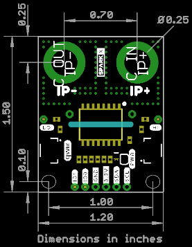

SparkX Power Meter - ACS37800 (Qwiic)
===================================================

[*SparkX Power Meter - ACS37800 (Qwiic) (SPX-17873)*](https://www.sparkfun.com/products/17873)

Need a power sensor that can sense voltage up to 60VDC and current up to 30A? This is the product for you!

The Allegro MicroSystems ACS37800 power monitoring IC greatly simplifies the addition of power monitoring to many powered systems and is ideal for
heavy current applications like:
- Monitoring the power drawn by a 3D-printer
- Monitoring the power drawn from a UAV battery
- Battery charging / conditioning
- Solar / photovoltaic panel power monitoring

Allegro’s Hall-effect-based, galvanically isolated current sensing technology achieves reinforced isolation ratings in a small PCB footprint.
These features enable isolated current sensing without expensive Rogowski coils, oversized current transformers, isolated operational amplifiers,
or the power loss of shunt resistors.

The ACS37800 power monitoring IC offers key power measurement parameters that can easily be accessed through its digital interface. Dedicated and
configurable I/O pins for voltage/current zero crossing, undervoltage and overvoltage reporting, and fast overcurrent fault detection are available.
User configuration of the IC is available through on-chip EEPROM.

Important Note
-------------------
This product is not suitable for low current applications due to the +/-0.1A RMS Noise on the current channel.

Sensing less than an Amp? This is _not_ the product for you...

Safety Information
-------------------
**Although the ACS37800 power monitoring IC is capable of monitoring AC power at high line voltages, the SparkX Power Meter is designed for
Safety Extra Low Voltage (SELV) applications of up to 60VDC only. Its use in AC power systems is _not_ recommended.**

Repository Contents
-------------------
* **/Documents** - datasheets etc.
* **/Hardware** - Eagle design files (.brd, .sch)
* **/Production_Test** - production test code (.ino) - run this in the Arduino IDE
* **LICENSE.md** - license information

Documentation
--------------
* **[ACS37800 Arduino Library](https://github.com/sparkfun/SparkFun_ACS37800_Power_Monitor_Arduino_Library)** - Arduino library for the SparkFun Power Meter - ACS37800.
* **[DRAFT Hookup Guide](./HOOKUP.md)** - Basic hookup guide for the SparkX Power Meter - ACS37800.

Product Versions
----------------
* [SPX-17873](https://www.sparkfun.com/products/17873) - Original SparkX Release.

License Information
-------------------

This product is _**open source**_!

Please review the LICENSE.md file for license information.

If you have any questions or concerns on licensing, please contact technical support on our [SparkFun forums](https://forum.sparkfun.com/viewforum.php?f=123).

Distributed as-is; no warranty is given.

- Your friends at SparkFun.
